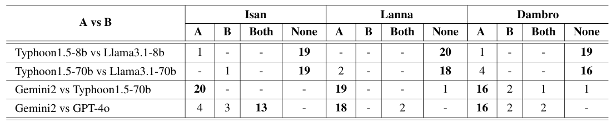

import Callout from '@/components/Callout.astro'
import SideBySide from '@/components/SideBySide.astro'

### Introduction to Kam Mueang (Northern Thai Language)

Northern Thai, also known as Kam Mueang, is a Southwestern Tai language spoken by approximately six million people, primarily in Northern Thailand. Traditionally written in the Tai Tham script, it is nowadays most commonly transcribed using the standard Thai script. However, this modern transcription often fails to accurately capture the language's unique six-tone system. While closely related to Standard Thai, Kam Mueang retains a distinct vocabulary and phonology deeply rooted in the history of the Lan Na Kingdom. Today, the language faces increasing pressure from "Thaification," leading many native speakers to code-switch between Kam Mueang and Standard Thai, especially in digital and urban spaces. [^1]

### Introduction to Lanna Script

The Lanna script, also known as the Tai Tham script, is an abugida used to write several Tai languages, including Kam Mueang, Tai Lue, and Khuen. It is believed to have originated from the Old Mon script and was introduced to the Lan Na Kingdom in the 13th century. The script consists of 44 consonants, 15 vowels, and several tone markers. [^2]

### Why Lanna Script and NLP/LLM?

As a native speaker of Kam Mueang, I have always been fascinated by my language and its rich history. Recently, I have become particularly interested in the potential of Natural Language Processing (NLP) and Large Language Models (LLMs) to help preserve and promote this low-resource language. This blog serves as a space where I can share my ongoing research and thoughts on these topics.

Being able to type the Lanna script natively across digital devices is a monumental step forward for our culture. I want to express my deep gratitude to the Unicode Consortium for making this possible, and for their years of hard work dating back to the early 2000s.

### LLM Capabilities on Lanna Script

I recently read in the Tai Tham Unicode Facebook group that Gemini 3 can now generate and understand the Lanna script. Intrigued by this capability, I decided to investigate it further. I began testing multiple LLMs currently available online, spanning both open-source and closed-source models. Here is the complete list of LLMs I evaluated:

#### Open Source LLMs (Available on HuggingFace)
- [Qwen3.5 397B-A17B](https://huggingface.co/Qwen/Qwen3.5-397B-A17B)
- [DeepSeek-V3.2-Speciale](https://huggingface.co/deepseek-ai/DeepSeek-V3.2-Speciale)
- [Mistral Large 3-2512](https://huggingface.co/mistralai/Mistral-Large-3-675B-Instruct-2512)
- [Llama 4 Maverick-17B-128E-Instruct](https://huggingface.co/meta-llama/Llama-4-Maverick-17B-128E-Instruct)
- [Llama 4 Scout-17B-16E-Instruct](https://huggingface.co/meta-llama/Llama-4-Scout-17B-16E-Instruct)
- [Qwen3 235B-A22B-Thinking-2507](https://huggingface.co/Qwen/Qwen3-235B-A22B-Thinking-2507)
- [DeepSeek R1](https://huggingface.co/deepseek-ai/DeepSeek-R1)
- [Kimi-K2-Thinking](https://huggingface.co/moonshotai/kimi-k2-thinking)
- [Kimi-K2.5](https://huggingface.co/moonshotai/Kimi-K2.5)
- [MiniMax M2.1 ](https://huggingface.co/minimaxai/MiniMax-M2.1)
- [GLM-4.7](https://huggingface.co/zai-org/GLM-4.7)
- [Deepseek V3.2](https://huggingface.co/deepseek-ai/DeepSeek-V3.2)

#### Closed Source LLMs (Openrouter API)
- [Qwen3.5 Plus 2026-02-15](https://openrouter.ai/qwen/qwen3.5-plus-02-15)
- [GPT-5.2](https://openrouter.ai/openai/gpt-5.2)
- [Mistral Medium 3.1](https://openrouter.ai/mistralai/mistral-medium-3.1)
- [Claude Sonnet 4.5](https://openrouter.ai/anthropic/claude-sonnet-4.5)
- [Claude Opus 4.5](https://openrouter.ai/anthropic/claude-opus-4.5)
- [Gemini 3 Flash](https://openrouter.ai/google/gemini-3-flash-preview)
- [Gemini 3 Pro](https://openrouter.ai/google/gemini-3-pro-preview)

### Results

In this section, I will share the results of evaluating these LLMs on Lanna translation tasks. Please note that not all LLMs were evaluated using the exact same prompt and input text; however, the results still provide a robust general idea of each model's performance. I have divided the evaluation into two distinct parts: Natural Language Understanding and Natural Language Generation.

#### **1. Natural Language Understanding**

Here is the prompt I used for the test:

> **Prompt:**
> Can you translate this passage to english: [LANNA_TEXT]

The source material was drawn from the *Lao Geography* book (1896) [^3] (Note: "Lao" was historically used by Siam to refer to the Lan Na people during the 19th century when Lan Na was a vassal state).

Here are my input texts:

<SideBySide leftTitle="Original (Lanna)" rightTitle="English Translation (By Gemini)">
  <Fragment slot="left">
    ᩅ᩵ᩣᨯ᩠ᩅ᩠ᨿ᩶ᨷᩕᨴᩮ᩠ᩆᨪᨻᩣᨶᩮ᩠ᨿᨴᩦ᩵ ᨶᩦ᩶ ᨧ᩠ᨠᩢᩅ᩵ᩣᨯ᩠ᩅ᩠ᨿ᩶ᨷᩕᨴᩮ᩠ᩆᨪᨻᩣᨶᩮ᩠ᨿ ᨶᩱ ᨴ᩠ᨲᩥ
    ᨴ᩠ᨦᩢᩈᩦ᩵ᩉᩯ᩠ᨦ᩵ᨷᩕᨴᩮ᩠ᩆᨪᨻᩣᨶᩮ᩠ᨿ ᨶᩢ᩠᩶ᨶ ᨾᩦᩋ᩵ᩣ᩠ᩅᨷᩥᩔᨣᩮ
    ᨠᩢ᩠ᨷ ᨷᩕᨴᩮ᩠ᩆᨺ᩠ᩃᩢ᩵ᨦ᩼ᩈᩮ᩠ᨲ ᩀᩪ᩵ᨴ᩠ᨲᩥᩉ᩠ᨶᩮᩬᩥᩋ᩼ ᨾᩦ ᨴᩃᩮ
    ᨾᩮᨯᩥᨴᩁᩮᨶ᩠ᨿᩁ᩼ ᩀᩪ᩵ ᨴᩥᨲ᩠ᨲᩅ᩠ᨶᩢᩋᩬᨠ᩼ᨾᩦᨴᩃᩮ
    ᨾᩮᨯᩥᨴᩁᩮᨶ᩠ᨿᩁ᩼ ᨠᩢ᩠ᨷ ᨾᩉᩣᩈ᩠ᨾᩩᨴ᩠᩼ᨴᩋᩢ᩠ᨯᩃᩢ᩠ᨶᨴᩥ᩠ᨠ
    ᩀᩪ᩵ ᨴᩥ᩠ᨲᨲᩱ᩶ ᨾᩦᨷᩕᨴᩮ᩠ᩆᨽᩰᨩᩪᨣᩯ᩠ᩃ ᨠᩢ᩠ᨷ ᨾᩉᩣᩈ᩠ᨾᩩᨴ᩠᩼ᨴᩋᩢ᩠ᨯᩃᩢ᩠ᨶᨴᩥ᩠ᨠ
    ᩀᩪ᩵ ᨴᩥᨲ᩠ᨲᩅ᩠ᨶᩢᨲᩫ᩠ᨠ ᨩᩣ᩠ᩅᨷᩕᨴᩮ᩠ᩆᨪᨻᩣᨶᩮ᩠ᨿ ᨶᩢ᩠᩶ᨶ
    ᨹᩥ᩠ᩅᨶᩮᩬᩥ᩶ᩋᩉ᩠ᨶ᩶ᩣᨲᩣᨹᩫ᩠ᨾᨡᩬᨦ᩼ᨡᩮᩢᩣᨣᩴ᩵ᩉ᩠ᨾᩮᩬᩥᩁ᩼ᨩᩣ᩠ᩅ
    ᨷᩕᨴᩮ᩠ᩆᩍᨴᩣᩃᩮ᩠ᨿ ᨶᩱᨷᩕᨴᩮ᩠ᩆᨶᩢ᩠᩶ᨶᨾᩦᨯᩬ᩠ᨿᩉ᩠ᩃᩣ᩠ᨿ
    ᩉᩯ᩠᩵ᨦᨯᩬ᩠ᨿᩉ᩠ᩃ᩶ᩣ᩠ᨦᨾᩬ᩵ᩁ᩼ᨣᩴ᩵ᩈᩪᨦ᩼ᨶᩢ᩠ᨠᨧᩫ᩠ᨶᩈᨶᩮᩣᨴᩦ᩵ᨤ᩶ᩣ᩠ᨦ
    ᩀᩪ᩵ᨷᩫ᩠ᨶᨯᩬ᩠ᨿᨶᩢ᩠᩶ᨶᨷᩴ᩵ᨶᩱ᩵ᩈᩢ᩠ᨠᨴᩮᩬᩥ᩵ᩋ᩼
  </Fragment>
  <Fragment slot="right">
    Regarding the country of Spain:
    Here, we will discuss the country of Spain and its four borders.
    To the north, it shares a border with the Bay of Biscay and the country of France.
    To the east, there is the Mediterranean Sea.
    To the south, there is the Mediterranean Sea and the Atlantic Ocean.
    To the west, there is the country of Portugal and the Atlantic Ocean.
    As for the people of Spain, their complexion, facial features, and hair are similar to those of the people of Italy.
    In that country, there are many mountains. Some of the mountains and hills are so high that the snow resting upon them never melts.
  </Fragment>
</SideBySide>

Here is another example:

<SideBySide leftTitle="Original (Lanna)" rightTitle="English Translation (By Gemini)">
  <Fragment slot="left">
    ᨣᩴ᩵ ᩁᩮᩨ᩵ᩬᩋ᩼ᨶᩲᨻᩕᨿᩌᩰᩅᩣᨧᩮᩢ᩶ᩣᩓᩁᩢ᩠ᨷᩅ᩵ᩣᨻᩕ ᨵᩢᨾ᩠᩼ᨾ ᨠᨾᩛᩦᨠᩮ᩶᩵ᩣ ᨸᩮ᩠ᨶ ᨣᩴᩣ ᨻᩕᨿᩌᩰᩅᩣ ᨲᩯ᩵ ᨡᩮᩢᩣ ᨷ᩵ ᩁᩢ᩠ᨷ ᩅ᩵ᩣᨻᩕᨿᩮᨪᩪ ᨣᩕᩥ᩠ᩇ 
    ᨸᩮ᩠ᨶ ᨷᩩᨲ ᩉᩯ᩠᩵ᨦ ᨻᩕᨧᩮᩢ᩶ᩣ ᩓ ᨡᩮᩢ᩶ᩣ ᨷᩴ᩵ ᨩᩮᩥ᩵ᩬᩋᨶᩲᨻᩕᨵᩢᨾ᩠᩼ᨾᨠᨾᩛᩦᩉᩲ᩠᩵ᨾ ᩋᩢ᩠ᨶ ᨶᩨ᩠᩵ᨦ ᨶᩲᩈᩣᩈ᩠ᨶᩣ ᨾᩉᩣᨾᩢ᩠ᨲ ᨶᩢ᩠᩶ᨶ ᩈᩬᩁ᩼ ᩅ᩵ᩣ ᨾᩦ 
    ᨻᩕ ᨧᩮᩢ᩶ᩣ ᨲᩯ᩵ ᩋᩫᨦ᩠᩼ᨣᨯ᩠ᨿᩅ᩼ ᩓ ᩈᩬᩁ᩼ ᩅ᩵ᩣ ᨾᩉᩣᨾᩢ᩠ᨲ ᨸᩮ᩠ᨶᨹᩪ᩶ ᨴᩴᩣᨶᩣ᩠ᩅ᩠ᨿᩉᩯ᩠᩵ᨦᨴ᩵ᩣ᩠ᨶ ᩓ ᨡᩮᩢᩣᨾᩦᩉᩢ᩠ᨶ᩠ᨦᩈᩨᨴᩦ᩵ᨾᩉᩣᨾᩢ᩠ᨲ ᨯᩱ᩶ 
    ᩃᩥᨡᩥᨲ᩠ᨲ ᨲᩯᩢ᩠ᨾ ᨡ᩠ᨿᩁ᩼ ᨲᩯ᩠᩵ᨦᩅᩱ᩠᩶ᨿ ᩃᩪᩁ᩼ ᨻᩕ ᨿᩮᨪᩪᨷᩢ᩠ᨦᨠᩮᩥ᩠ᨭ ᪆᪀᪀ ᨸᩦ᩠ᩃ ᨶᩲᩉᩢ᩠ᨶ᩠ᨦᩈᩨᨴᩦ᩵ᨾᩉᩣᨾᩢ᩠ᨲᨯᩱ᩶ ᩃᩥᨡᩥᨲ᩠ᨲ ᨲᩯᩢ᩠ᨾ 
    ᨲᩯ᩠᩵ᨦᨶᩢ᩠᩶ᨶ ᩉ᩠᩵ᨾᩪ ᩃᩪᨠ᩼ ᩈᩥ᩠ᨠ ᨾᩉᩣᨾᩢ᩠ᨲ ᨡᩮᩢᩣᨯᩱ᩶ᩁᩢ᩠ᨷᨸᩮ᩠ᨶᨻᩕᨵᩢᨾ᩠ᨾ᩺ᨠᨾᩛᩦᨡᩬᨦ᩼ᨡᩮᩢᩣ ᩓ ᨻᩕ ᨵᩢᨾ᩠ᨾ᩺ᨠᨾᩛᩦᨴᩦ᩵ᩅ᩵ᩣᨾᩣᨶᩦ᩶ᨩᩨ᩵
    ᩅ᩵ᩣᨤᩰᩁᩢ᩠ᨶ ᨤᩫ᩠ᨶ ᨩᩣ᩠ᩅ ᨷᩕ ᨴᩮ᩠ᩆ ᩋᩨ᩠᩵ᨶ ᨡᩮᩢᩣ ᨩᩮᩥ᩵ᩬᩋ᩼ᨶᩲᩈᩣᩈ᩠ᨶᩣ ᨾᩉᩣ ᨾᩢ᩠ᨲ ᨶᩢ᩠᩶ᨶ ᩋᩢ᩠ᨶ ᨶᩥ᩠᩵ᨦ ᩈᩣᩈ᩠ᨶᩣ
    ᨻᩕᨤᩰᨲᨾ ᨸᩮ᩠ᨶ ᩈᩣᩈ᩠ᨶᩣ ᩉᩯ᩠᩵ᨦ ᨩᩣ᩠ᩅ ᨷᩕᨴᩮ᩠ᩆ ᩈ᩠ᨿᩣ᩠ᨾ ᨶᩦ᩶ ᩓ ᨶᩬᨠ᩼ᨧᩣ᩠ᨠᨩᩣ᩠ᩅᨷᩕ ᨴᩮ᩠ᩆᩈ᩠ᨿᩣ᩠ᨾ
    ᨶᩦ᩶ ᨾᩦ ᨾᩮᩬᩥᨦ᩼ ᩋᩨ᩠᩵ᨶ ᨳᩯ᩠ᨾ ᩉᩖᩣ᩠ᨿ ᨾᩮᩥᩬᨦ᩼ ᨴᩦ᩵ ᨳᩨ ᩈᩣᩈ᩠ᨶᩣᨻᩕᨤᩰᨲᨾ ᨶᩦ᩶ ᩋᩢ᩠ᨶᨶᩨ᩠᩵ᨦᨤᩫ᩠ᨶᨴᩦ᩵ᨳᩨᩈᩣᩈ᩠ᨶᩣᨻᩕᩣᩉ᩠᩼ᨾ
    ᨩᩮᩨ᩵ᩬᩋ᩺ ᩅ᩵ᩣ ᨻᩕᨧᩮᩢ᩶ᩣᨡᩬᨦ᩼ ᨡᩮᩢᩣ ᨾᩦ ᩉᩖᩣ᩠ᨿᩋᩫᨦ᩠᩼ᨣ ᨡᩮᩢᩣᨩᩮᩥ᩵ᩬᩋ᩼ ᩅ᩵ᩣ ᨻᩕᨧᩮᩢ᩶ᩣᨡᩬᨦ᩼ ᨡᩮᩢᩣ ᩉᩖᩢᩣ᩠ᨦᨴᩮᩥ᩵ᩬᩋ᩼ᨯᩱ᩶ ᩃᩫ᩠ᨦ ᨾᩣ
    ᨴᩦ᩵ ᨹᩯ᩠᩵ᨶᨯᩥ᩠ᨶ ᩃᩰᩫ᩠ᨠ ᨶᩦ᩶ ᩉᩢᩖᩣ᩠ᨦ ᨴᩮᩬᩥ᩵ᩋ᩼ ᨸᩮ᩠ᨶᨤᩫ᩠ᨶᩉᩢᩖᩣ᩠ᨦᨴᩮᩥ᩵ᩬᩋ᩼ᨸᩮ᩠ᨶᩈᩢ᩠ᨲ ᩓ
  </Fragment>
  <Fragment slot="right">
    ...[they] also believe in Lord Jehovah and accept that the Old Testament is the word of Jehovah. But they do not accept that Jesus Christ is the Son of God, and they do not believe in the New Testament.
Furthermore, the religion of Muhammad teaches that there is only one God, and it teaches that Muhammad is His prophet. They have a book that Muhammad wrote and composed 600 years after Jesus was born. The disciples of Muhammad accepted that book, which he wrote and composed, as their holy scripture. And this holy scripture mentioned here is named the Koran. People of other countries believe in that religion of Muhammad.
Furthermore, the religion of Gautama [Buddhism] is the religion of the people of this country of Siam. And besides the people of this country of Siam, there are many other countries that follow this religion of Gautama.
Furthermore, people who follow the Brahmin religion [Hinduism] believe that they have many gods. They believe that their gods sometimes descend to this earth—sometimes taking the form of humans, and sometimes taking the form of animals.
  </Fragment>
</SideBySide>

Also, there is another input text. I manually translated the question from the
Global MMLU Lite Dataset [^4].

<SideBySide leftTitle="Original (Lanna)" rightTitle="English Translation (By Gemini)">
  <Fragment slot="left">
    ***ᨣᩣᩴᨳᩣ᩠ᨾᨶᩦ᩶ᩋ᩶ᩣ᩠ᨦᩋᩥ᩠ᨦᨧᩣ᩠ᨠᨡᩬᩴ᩶ᨾᩪᨴᩣ᩠ᨦᩃᩩ᩵ᨾ:***

" ᨼ᩠ᩃᩬᩴᩁᩮᨶ᩠ᩈ᩺ᨦᩣ᩠ᨾ ᩓ ᨾᩦᩋᩣᨿᩩᨠᩯ᩵ᩉ᩠ᩃᩮᩬᩥᩋᩅᩮᨶᩥ᩠ᩈᨡᩬᨦᨴ᩵ᩣ᩠ᨶᨳᩮᩥ᩠ᨦ 540 ᨸᩦ… ᩉ᩠ᨾᩪ᩵ᩁᩮᩢᩣᨾᩦᨴᩦ᩵ᨯᩥ᩠ᨶᨷᩕᩉ᩠ᨾᩣ᩠ᨱ 
30,000 ᩉᩯ᩠᩵ᨦ ᨸᩮ᩠ᨶᨡᩬᨦᨡᩩᩁᨶᩣ᩠ᨦ ᩓ ᨻᩬᩴ᩵ᨣ᩶ᩣ ᨩᩣ᩠ᩅᨾᩮᩬᩥᨦ ᩓ ᩈ᩠ᩃ᩵᩻ᩣ ᨪᩧ᩠᩵ᨦᩉᩨ᩶ᨹᩫ᩠ᩃᨹ᩠ᩃᩥᨲ᩻ᨠᩢ᩠ᨷᩁᩮᩢᩣᨣᩪ᩵ᨸᩦᨴᩧ᩠ᨦ 
ᨡᩮᩢ᩶ᩣᩉ᩠ᨶᩫᨾᨸᩢ᩠ᨦ ᩓ ᨩᩥ᩠᩶ᨶ ᩅᩱᨶ᩺ᩓᨶᩣᩴ᩶ᨾᩢ᩠ᨶ ᨹᩢ᩠ᨠᩓᨩᩦ᩠ᩈᩉ᩠ᨿ᩶ᩣᩉᩯ᩠᩶ᨦᩓᨾᩱ᩶ ᨣᩧ᩠ᨯᨸᩮ᩠ᨶᨾᩪᩃᨣ᩵ᩣ 9,000 ducat 
ᨸᩮ᩠ᨶᨦᩮᩥ᩠ᨶᩈ᩠ᨯᩫ… ᩉ᩠ᨾᩪ᩵ᩁᩮᩢᩣᨾᩦᨠᩣ᩠ᩁᨣ᩶ᩣ 2 ᩀ᩵ᩣ᩠ᨦ ᨣᩨᨠᩣ᩠ᩁᨣ᩶ᩣᨡᩫ᩠ᨶᩈᩢ᩠ᨲ ᩓ ᨹ᩶ᩣᩉ᩠ᨾᩱ ᨪᩧ᩠᩵ᨦᨾᩦᨾᩪᩃᨣ᩵ᩣᨶᩢ᩠ᨠᩉ᩠ᩃᩮᩬᩥᩋ
ᨠᩣ᩠ᩁᨣ᩶ᩣᨴᩢ᩠ᨦᩈᩦ᩵ᩀ᩵ᩣ᩠ᨦᨡᩬᨦᩅᩮᨶᩥ᩠ᩈᩁᩬᨾᨠᩢ᩠ᨶᩉᩯ᩠ᨾ ᨼ᩠ᩃᩬᩴᩁᩮᨶ᩠ᩈ᩺ᩋᩢ᩠ᨶᨦ᩠ᨯᨦᩣ᩠ᨾᨡᩬᨦᩁᩮᩢᩣᨾᩦᩁ᩶ᩣ᩠ᨶᨣ᩶ᩣᨡᩬᨦᩈᨾᩣᨣᩫ᩠ᨾᨻᩬᩴ᩵ᨣ᩶ᩣ
ᨡᩫ᩠ᨶᩈᩢ᩠ᨲᨧᩣᩴᨶ᩠ᩅᩁ 270 ᩉᩯ᩠᩵ᨦᩀᩪ᩵ᨶᩱᩅ᩠ᨿᨦ ᩈᩥ᩠ᨶᨣ᩶ᩣᨧᩣ᩠ᨠᨴᩦ᩵ᩉᩢ᩠᩶ᨶᨳᩪᨠᩈᩫ᩠᩵ᨦᨻᩱᨿᩢ᩠ᨦᩁᩰ᩠ᨾ ᩓ ᨾᩣᩁ᩺ᨣᩮ ᨶᩮᨻᩮᩥ᩠ᩃᩈ᩺
ᩓ ᨪᩥᨪᩥᩃᩦ ᨤᩬᩁᩈᨴᩯ᩠ᨶᨴᩥᨶᩰᨻᩮᩥ᩠ᩃ ᩓ ᨴᩧ᩠ᨦᩉ᩠ᨾᩫᨯᨴᩩᩁᨣᩦ ᨶᩬᨠᨧᩣ᩠ᨠᨶᩦ᩶ᨿᩢ᩠ᨦᨾᩦᩁᩰ᩠ᨦᨠᩮᩢ᩠ᨷᨣᩕ᩠ᩅᩫᨣ᩶ᩣᩋᩢ᩠ᨶᨾᩢ᩠᩵ᨦᨤᩢ᩠᩵ᨦ ᩓ 
ᩋᩰ᩵ᩋ᩵ᩣᨡᩬᨦᩈᨾᩣᨣᩫ᩠ᨾᨻᩬᩴ᩵ᨣ᩶ᩣᨹ᩶ᩣᩉ᩠ᨾᩱᩉᩯ᩠ᨾ 83 ᩉᩯ᩠᩵ᨦ "
—Benedetto Dei, "Letter to a Venetian," 1472

***ᨡᩬᩴ᩶ᨣ᩠ᩅᩣ᩠ᨾᨴᩣ᩠ᨦᨷᩫ᩠ᨶᨶᩦ᩶ᩈᩣᨾᨲ᩠ᨳᨩᩱ᩶ᨸᩮ᩠ᨶᩉ᩠ᩃᩢᨠᨮᩣ᩠ᨶᨩᩦ᩶ᩉᩨ᩶ᩉᩢ᩠ᨶᩃᩢᨠ᩠ᩇᨱᨴᩣ᩠ᨦᩅᩢᨯ᩠ᨰᨶᨵᩢᨾ᩠ᨾ᩺ᨿᩩᨣᨼᩨ᩠᩶ᨶᨼᩪᩆᩥᩃ᩠ᨷᩅᩥᨴ᩠ᨿᩣ 
(Renaissance) ᨡᩬᩴ᩶ᨯᩱᨲᩬᩴ᩵ᩴᩴᨻᩱᨶᩦ᩶***

1. **A:** ᨣ᩠ᩅᩣ᩠ᨾᨽᩪᨾᩥᨧᩱᨶᩱᨣ᩠ᩅᩣ᩠ᨾᨸᩮ᩠ᨶᨻᩫ᩠ᩃᨾᩮᩬᩥᨦ
2. **B:** ᨠᩣ᩠ᩁᩏᨷᨳᩢ᩠ᨾᨽ᩺ᩆᩥᩃ᩠ᨷ
3. **C:** ᩋᩢᩆ᩠ᩅᩥᨶᨵᩢᨾ᩠ᨾ᩺ (Chivalry)
4. **D:** ᨣ᩠ᩅᩣ᩠ᨾᨽᩪᨾᩥᨧᩱᨶᩱᨠᩣ᩠ᩁᨠᩯ᩠ᩅ᩵ᩁᩆᩥᩃ᩠ᨷᨠᩣ᩠ᩁᨴᩉᩣ᩠ᩁ
  </Fragment>
  <Fragment slot="right">
    ***This question is based on the information below:***
" Beautiful Florence is older than your Venice by 540 years... 
We have about 30,000 estates belonging to nobles and merchants, citizens and craftsmen, 
which yield products to us every year including bread and meat, wine and oil, vegetables 
and cheese, hay and wood, valued at 9,000 ducats in cash... We have two trades, namely 
the wool trade and the silk trade, which are worth more than all four trades of Venice combined. 
Our beautiful Florence has 270 shops of the wool merchants' guild located in the city. 
Goods from there are sent to Rome and the Marche, Naples and Sicily, Constantinople and all of Turkey. 
Besides this, there are also 83 wealthy and splendid warehouses of the silk merchants' guild. "
— Benedetto Dei, "Letter to a Venetian," 1472

***The text above can be used as evidence to point out which of the following cultural 
characteristics of the Renaissance era?***

1. **A:** Civic pride (Pride in citizenship)
2. **B:** Patronage of the arts
3. **C:** Chivalry
4. **D:** Pride in military prowess
  </Fragment>
</SideBySide>

##### **LLM Performance Evaluation: Tai Tham (Lanna) Translation**

| Models | Output Generated? / Refused? | Time | Quality of Translation | Note |
| :--- | :--- | :--- | :--- | :--- |
| **Qwen3.5 397B-A17B** | Yes | Long | Poor | |
| **DeepSeek-V3.2-Speciale** | Yes | Very Long | Unusable | > 10 minutes |
| **Mistral Large 3-2512** | Yes | Fast | Unusable | |
| **Llama 4 Maverick-17B-128E-Instruct** | No | Fast | Refused | |
| **Llama 4 Scout-17B-16E-Instruct** | No | Fast | Refused | |
| **Qwen3 235B-A22B-Thinking-2507** | Yes | Acceptable | Unusable | |
| **DeepSeek R1** | Yes | Long | Unusable | |
| **Kimi-K2-Thinking** | No | Long | Unusable | |
| **Kimi-K2.5** | No | Long | Unusable | |
| **MiniMax M2.1** | No | Failed | Refused | Endless Random Token Output |
| **GLM-4.7** | No | Long | Unusable | |
| **Deepseek V3.2** | Yes | Long | Unusable | Some words related to text |
| **Qwen3.5 Plus 2026-02-15** | Yes | Long | Poor | |
| **GPT-5.2** | Yes | Long | Unusable | |
| **Mistral Medium 3.1** | Yes | Fast | Unusable | |
| **Claude Sonnet 4.5** | Yes | Acceptable | Poor | |
| **Claude Opus 4.5** | Yes | Long | Good | |
| **Gemini 3 Flash** | Yes | Fast | Good | |
| **Gemini 3 Pro** | Yes | Acceptable | Good | |

---

##### **Lanna LLM Scoring Framework**

###### **1. Translation Quality Score**
| Rating | Description |
| :--- | :--- |
| **Good** | Accurate and readable; high preservation of original meaning and script logic. |
| **Fair** | Understandable but contains minor errors in retyping or syntax. |
| **Poor** | Significant errors; requires heavy human editing to be useful. |
| **Unusable** | Complete failure in meaning or script rendering; gibberish. |
| **Refused** | Model refuses to answer or produces a hallucination unrelated to the prompt. |

###### **2. Generation Time Score**
| Rating | Threshold | User Experience |
| :--- | :--- | :--- |
| **Fast** | **< 60 seconds** | Ideal for interactive tasks and quick lookups. |
| **Acceptable** | **1 – 3 minutes** | Suitable for long-form research or batch processing. |
| **Long** | **> 3 minutes** | Noticeable friction; requires a "wait and return" workflow. |
| **Very Long** | **5+ minutes** | Extremely sluggish; often indicates high computational overhead. |
| **Failed** | **N/A** | Model timed out, crashed, or entered an infinite loop. |

#### **2. Natural Language Generation**
For the Natural Language Generation test, I primarily worked with Gemini 3 Flash (currently, I see no distinguishable difference in writing quality between Gemini 3 Flash and Gemini 3 Pro).
The Gemini 3 Series models are undeniably fast, cheap, and highly proficient at Lanna string manipulation. While Claude Opus 4.5/4.6 are also remarkably good at Lanna, they remain prohibitively expensive.
To put it in perspective, Gemini 3 Flash is the most economical choice at around \$0.01 per question, while Gemini 3 Pro costs roughly \$0.15 per question.
In stark contrast, Claude Opus 4.5/4.6 costs over \$1.00 per question. I gave the models basic instructions to translate an English phrase into Lanna.

I chose the famous quote from John F. Kennedy:

> We choose to go to the Moon not because it is easy, but because it is hard. – John F. Kennedy

<SideBySide leftTitle="Gemini 3 Flash Output" rightTitle="Corrected (Lanna)">
  <Fragment slot="left">
    ᩉ᩠ᨾᩪᩉᩮᩢᩣᩃᩮᩬᩥᨠᨴᩦ᩵ᨧᩢᨠᨻᩱᨯ᩠ᩅᨦᨧᩢᨶ᩠ᨴᩕ᩺ ᨷᩴ᩵ᨩᩱ᩵ᨿᩬ᩶ᨶᩅ᩵ᩣᨾᩢ᩠ᨶᨦᩣ᩠᩵ᨿ ᨲᩯ᩵ᨿᩬ᩶ᨶᩅ᩵ᩣᨾᩢ᩠ᨶᨿᩣᨠ
  </Fragment>
  <Fragment slot="right">
    ᩉ᩠ᨾᩪ᩵ᩁᩮᩢᩣᩃᩮᩬᩥᨠᨴᩦ᩵ᨧᩡᨻᩱᨯ᩠ᩅᨦᨧᩢᨶ᩠ᨴᩕ᩺ ᨷ᩵ᨩᩱ᩵ᨿᩬ᩶ᩁᩅ᩵ᩤᨾᩢ᩠ᨶᨦ᩵ᩣ᩠ᨿ ᨲᩯ᩵ᨿᩬ᩶ᩁᩅ᩵ᩤᨾᩢ᩠ᨶᨿᩣ᩠ᨠ
  </Fragment>
</SideBySide>

As seen above, even with relatively simple vocabulary, Gemini still occasionally introduces typos and spelling inconsistencies. How should we tackle this limitation moving forward? That remains an open question.

### Why are paid models better at Lanna?
In this section, I want to discuss a few interesting observations from our evaluation:

1. It is abundantly clear that open-source models currently lag far behind proprietary, paid models when it comes to the Lanna script.
2. Gemini stands out as both economically viable and lightning-fast, demonstrating a remarkably high understanding of the script.
3. Claude also possesses a strong grasp of Lanna, but its high inference cost makes it less accessible.

**The big question is: WHY are paid models so much better at Lanna?** I will focus my theory on Gemini 3.

The Lanna script features a deeply complex orthographic structure, completely unlike English and significantly more intricate than modern Thai. Furthermore, it is a script used almost exclusively by a minority group in Thailand and lacks official government backing or standardized educational support. Consequently, there is an extreme scarcity of digitized Lanna data available online. I estimate that the total volume of "ready-to-use" digital Lanna text might only range between 20,000 to 200,000 words. This data drought is exacerbated by the fact that most people still write Lanna strictly on physical paper or rely heavily on Thai-based fonts, simply because standard Tai Tham Unicode is not yet fully supported by ubiquitous software like Microsoft Office.

An interesting recent research paper might help explain Gemini's dominance in this area. Titled ***"Assessing Thai Dialect Performance in LLMs with Automatic Benchmarks and Human Evaluation"*** [^5], the study explores how effectively modern LLMs process localized Thai dialects.

Here are two key findings from the paper:

1. Gemini performs best across all local Thai dialects when compared to its peers. Human evaluators consistently preferred Gemini's outputs across the board.
2. No open-source models (including Llama and Typhoon—a Thai-centric model developed by SCB 10X) performed adequately in these evaluations.

<figure class="text-center [&_p]:m-1.5 [&_img]:m-1.5">
  
  <figcaption>Table 2: Human fluency preference on conversation and food topics. [^5]</figcaption>
</figure>

These findings perfectly align with my own experiments. The data overwhelmingly suggests that Gemini currently reigns supreme in Lanna language tasks.

### Final Thoughts
1. Current open-source models still lack the fundamental capability to process and understand the Lanna script.
2. We urgently need more comprehensive, standardized benchmarks to accurately assess real-world model capabilities in this language.
3. It may already be viable to build specialized applications utilizing Lanna text on top of the Gemini API.
4. Translating from Lanna to higher-resource languages (like English or Standard Thai) is largely possible today.
5. Conversely, translating from higher-resource languages into Lanna still requires heavy human intervention, although semi-automated, "human-in-the-loop" workflows are becoming feasible.
6. LLMs suffer from a severe lack of Northern Thai vocabulary knowledge. Models frequently hallucinate by substituting Central Thai words written in Lanna script, rather than using authentic Northern Thai vocabulary (a phenomenon colloquially known as *ไทยปะแล๊ดเมือง*).
7. Systematically digitizing the Lanna–Thai dictionary and pursuing targeted fine-tuning could drastically alleviate this issue. For instance, the renowned *"พจนานุกรมล้านนา-ไทย ฉบับ แม่ฟ้าหลวง"* (Mae Fah Luang Lanna-Thai Dictionary) contains roughly 22,000 entries. In contrast, the current Lanna database on Wiktionary holds only about 1,500 words. Injecting even a few thousand well-curated entries into training pipelines could teach LLMs proper orthography—especially for complex loanwords from Pali, Sanskrit, and English, whose Lanna spellings deviate wildly from native Northern Thai conventions.

### Future Work
Moving forward, I plan to focus my efforts on two primary initiatives:
1. Developing formal, comprehensive evaluations and benchmarks for LLMs operating on the Lanna script.
2. Contributing to the active digitization of the Lanna–Thai dictionary to expand the open-source corpus.

While the gap between massive, proprietary AI models and open-source alternatives remains vast for low-resource languages like Lanna, it is genuinely exciting to see tools like Gemini finally making our script digitally functional.

Thank you so much for reading! I hope you found this deep dive into the intersection of Kam Mueang heritage and modern AI technology as fascinating as I did.

---

[^1]: Northern Thai language. (n.d.). In *Wikipedia*. Retrieved February 21, 2026, from https://en.wikipedia.org/wiki/Northern_Thai_language
[^2]: Tai Tham script. (n.d.). In *Wikipedia*. Retrieved February 21, 2026, from https://en.wikipedia.org/wiki/Tai_Tham_script
[^3]: McGilvary, C. H. (1896). Lao Geography. Chiang Mai: Wang Sing Kham Press. (Email me for PDF copy)
[^4]: Global MMLU Lite Dataset. (2025). In *Hugging Face*. Retrieved February 21, 2026, from https://huggingface.co/datasets/CohereLabs/Global-MMLU-Lite
[^5]: Assessing Thai Dialect Performance in LLMs with Automatic Benchmarks and Human Evaluation. (2025, April). In *arXiv*. Retrieved February 21, 2026, from https://arxiv.org/abs/2504.05898